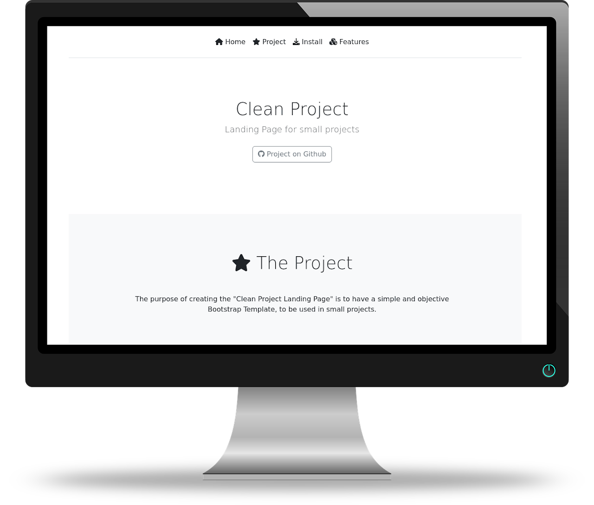

<h2 align=center><b>Clean Project - Landing Page</b></h2>

# <div align=center></div>

The purpose of creating the "Clean Project - Landing Page" is to have a simple and objective Bootstrap Template, to be used in small projects.

Demonstration: <a href="https://melchisedech333.github.io/projects/clean-project/index.html">https://melchisedech333.github.io/projects/clean-project/</a>

<br>

:bookmark_tabs: Table of Contents
-----
* [Installation](#hammer_and_wrench-installation)
* [Features](#heavy_plus_sign-features)
* [References and Links](#link-references-and-links)
* [Author](#smiley-author)
* [License](#scroll-license)
-----

<br>

:hammer_and_wrench: Installation
---

To download the template, clone the directory.

```bash
git clone https://github.com/melchisedech333/clean-project-landing-page.git
```
<br>


:heavy_plus_sign: Features
---

Resources:
- Fixed Navbar (top menu).
- Small presentation area.
- Area for complete project presentation.
- Installation area (Highlight.js support).
- Project features area.
- Footer with general information (author and license).

<br>

:link: References and Links
---

### Bootstrap

Website: https://getbootstrap.com/<br>
Examples: https://getbootstrap.com/docs/5.2/examples/


### Highlight.js

Syntax highlighting librarie.

Link: https://highlightjs.org/usage/

<br>

:smiley: Author
---

YouTube: [Melchisedech](https://www.youtube.com/channel/UC4Sh4wxncr5arnydpUfWPKw)<br>
Twitter: [Melchisedech333](https://twitter.com/Melchisedech333)<br>
Blog: [melchisedech333.github.io](https://melchisedech333.github.io/)<br>
LinkedIn: [Melchisedech Rex](https://www.linkedin.com/in/melchisedech-rex-724152235/)


<br>

:scroll: License
---

[ BSD-3-Clause license](./LICENSE.txt)


