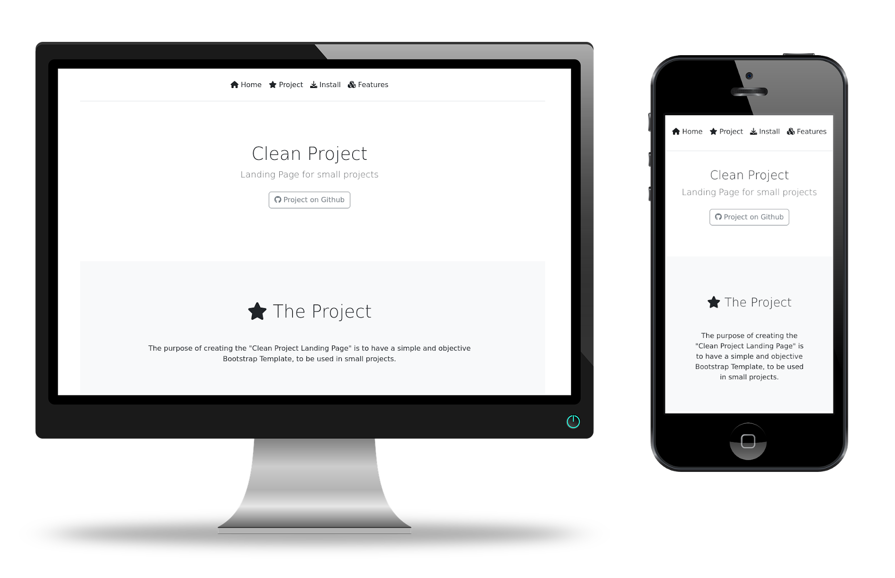

<h2 align=center><b>Clean Project - Landing Page</b></h2>

# <div align=center></div>

The purpose of creating the "Clean Project Landing Page" is to have a simple and objective Bootstrap Template, to be used in small projects.

<br>

:bookmark_tabs: Table of Contents
-----
* [Installation](https://github.com/verbum-paper/verbum-paper#hammer_and_wrench-installation)
* [Features](https://github.com/verbum-paper/verbum-paper#heavy_plus_sign-features)
* [References and Links](https://github.com/verbum-paper/verbum-paper#link-references-and-links)
* [Author](https://github.com/verbum-paper/verbum-paper#smiley-author)
* [License](https://github.com/verbum-paper/verbum-paper#scroll-license)
-----


:hammer_and_wrench: Installation
---

To download the template, clone the directory.

```bash
git clone https://github.com/melchisedech333/clean-project-landing-page.git
```


:heavy_plus_sign: Features
---

Resources:
- Fixed Navbar (top menu).
- Small presentation area.
- Area for complete project presentation.
- Installation area (Highlight.js support).
- Project features area.
- Footer with general information (author and license).


:link: References and Links
---

### Bootstrap


:smiley: Author
---

YouTube: [Melchisedech](https://www.youtube.com/channel/UC4Sh4wxncr5arnydpUfWPKw)<br>
Twitter: [Melchisedech333](https://twitter.com/Melchisedech333)<br>
Blog: [melchisedech333.github.io](https://melchisedech333.github.io/)<br>
LinkedIn: [Melchisedech Rex](https://www.linkedin.com/in/melchisedech-rex-724152235/)


:scroll: License
---

[ BSD-3-Clause license](./LICENSE.txt) © Verbum Paper


